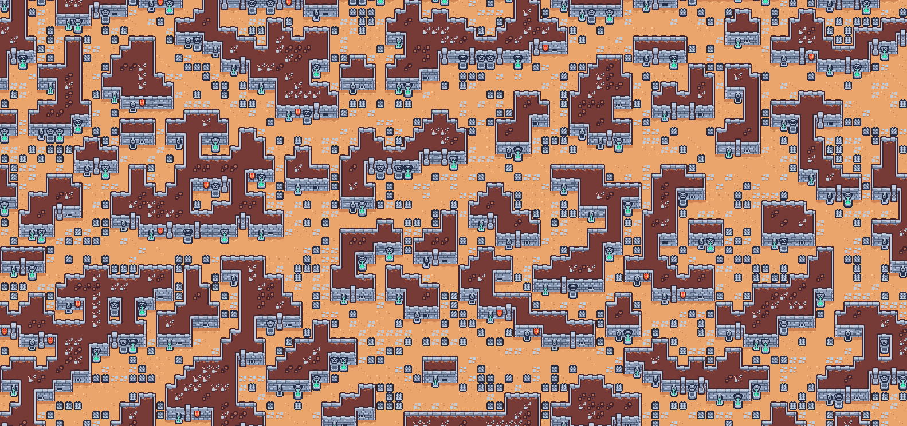
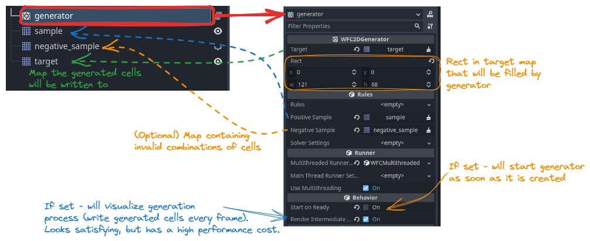

# WFC (Wave Function Collapse) and generic constraint-solving implementation for Godot 4

Features:
- **Backtracking** support.
  This addon implements backtracking, so it's possible to generate maps that are guaranteed to have no broken cells.
  However, it may take a lot more time (and more memory) so it's possible to disable backtracking or limit the number of attemts.
- **Multithreading**.
  Generation of a 2d map using WFC algorithm can be split into few tasks.
  Some of the tasks can be executed concurrently.
  The algorithm is able to detect cases when it's impossible to split the task and fallback to single-threaded generation in such cases.
- **Learning from example**.
  2d WFC generator is able to infer rules from an example of a valid map.
  The algorithm also tries to infer some valid cell combinations beyond those provided in the example.
  In cases when algorithm produces some invalid or not-nice-looking cell combinations, it's possible to also provide examples of cell combinations that should not appear in the final result.
  Or stop the generator from searching for additional cell combinations and provide all possible combinations in the initial example.
- Supports **different node types**:
	- `TileMap`
	- `GridMap` (a flat map in one of XY/YZ/XZ planes can be generated)
	- Support of other node types can be added.
- **Not just WFC**.
  Addon contains a generic implementation of a constraint-solving algorithm on top of which a WFC algorithm is built.
  This generic algorithm implementation can be reused for tasks different from WFC.

What's not (yet) implemented:
- 3d map generation.
  Generation of 3d maps (for `GridMap`s or multi-layered `TileMap`s) is not yet implemented.
- Wrapping.
- Tile probabilities.
  It's currently not possible to control probabilities of certain tile types being "observed".
- Rules editor.
  Currently it's possible to "learn" WFC rules in running game only, not in editor.
  Rules can be edited by modifying sample maps, using standard editor tools.
  There is no special editor for WFC rules.
- Better demo/examples.
- Symmetry.
  In cases when a cell can be rotated (`GridMap`), the algorithm treats each combination of tile type and rotation as a separate tile type.
  So, you have to specify possible adjacent tiles for all rotations of each tile (in fact, just few are enough - the algorithm is able to infer other combinations automatically in most cases).

## How to use

### WFC2DGenerator node

The easiest way to use this addon to generate a map is by using a `WFC2DGenerator` node.

To do so follow the following steps:

1. Create (or use existing one) a tile set (if you're going to generate a 2d tile map) or mesh library (in case of a grid map).
2. Make a map (a TileMap or GridMap) with examples of how your tiles should be used.
3. Create a TileMap or GridMap generated map will be written to.
   The new map should use the same tile set/mesh library as one created on step 2.
   You may place some tiles on that map (eighter manually or procedurally), generator will take them into account and fill other cells accordingly.
   But try to not create an unsolvable puzzle when doing so.
4. Create a `WFC2DGenerator` node and set the following properties:
   - `target` should point to a map node that will contain a generated map - one created at step 3
   - `positive_sample` should point to a node that contains an example of a valid map - created at step 2
   - `rect` should contain a rect of target map that will be filled by generator
   - there are some other settings that may influence behavior and performance of the generator, feel free to experiment with those after you have a basic setup running
5. Run the generator.
   By default it will start as soon as a scene runs.
   However, you can clear `start_on_ready` flag and call `start()` method on generator node manually.
   For example, that can be useful if you fill some of cells in target map procedurally.

The resulting setup may look like the following:

Examples of such setups can be found in [examples](addons/wfc/examples) folder.

It may make sense to create and keep a minimal scene with generator, sample map and target map - just to ensure that samples are good enough to generate a good map with your tile set.

If some of tile combinations produced by generator don't look good - try adding a negative samples map and place tose combinations there.

### Advanced use

`WFC2DGenerator` node is a high-level convenient wrapper for lower-level components.
In some cases it may be useful to use the low-level components directly.
See [sudoku demo](addons/wfc/examples/demo_sudoku.tscn) as an example.

You can extend different classes of this addon to achieve a desired behavior different from what is available by default.
For example, you can:
- add support for different map types by implementing your own [`WFCMapper2D`](addons/wfc/problems/2d/mappers/mapper_2d.gd) subclass
- add support of global constraints by extending [`WFC2DProblem`](addons/wfc/problems/2d/problem_wfc_2d.gd)
- use your own versions of internal components with the same interface as `WFC2DGenerator` by creating your own subclass of `WFC2DGenerator`

There is no detailed documentation (at least, for now) on how to use or extend internal components of the addon.
So please refer to source code to find a way to do what you need and feel free to ask questions in [github issues](https://github.com/AlexeyBond/godot-constraint-solving/issues).

## Copyright notes

This addon is licenced under MIT licence.

Examples/demos use [assets](addons/wfc/examples/assets) from [Kenney](https://kenney.nl/).

This addon uses [GUT](https://github.com/bitwes/Gut) for unit testing (not included in downloadable archive).

The [logo](./icon.png) is generated using Stable Diffusion.
